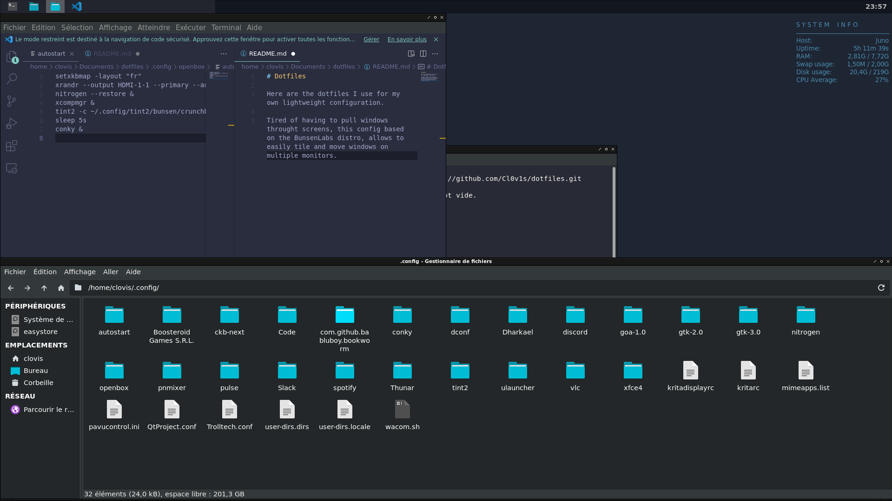

# Dotfiles

Here are the dotfiles I use for my own lightweight configuration.

Tired of having to pull windows throught screens, this config based on the BunsenLabs distro, allows to easily tile and move windows on multiple monitors. 

## What you need 

* openbox
* nitrogen
* tint2
* conky
* xcompmgr

## Shortcuts 

* Super + space: show uLaunchers
* Super + q: Close active window
* Super + left: tile active window on left
* Super + right: tile active window on right
* Super + down: tile active window on bottom
* Super + up: tile active window on top
* Super + Shift + left: move active window on left monitor*
* Super + Shift + right: move active window on right monitor*

(* prev and next monitor may be different on your system. If that so, you should edit the .config/openbox/rc.xml file accordingly)
